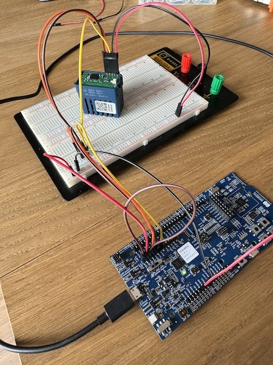

# OpenVSH

OpenVSH is an open-source firmware for [Vimar Smart Home](https://www.vimar.com/en/int/smart-home-15487122.html) devices. It uses the Zigbee standard for device control and Bluetooth Low Energy (BLE) for Firmware Over-The-Air (FOTA) updates.

### History and Motivation

I have a [Vimar Smart Home](https://www.vimar.com/en/int/smart-home-15487122.html) system installed in my home, primarily chosen for its compatibility with the Zigbee protocol. However, the functionality of the products is quite limited. For example, on the [2-way switch](https://www.vimar.com/en/int/catalog/product/index/code/19592.0), it's impossible to customize the status LED, the [rolling shutter](https://www.vimar.com/en/int/catalog/product/index/code/19594.0) is cumbersome to configure, and some features are entirely lost on the [thermostat](https://www.vimar.com/en/int/catalog/product/index/code/02973.B). I decided to purchase their [gateway](https://www.vimar.com/en/int/catalog/product/index/code/19597.B) and switched all devices to Bluetooth mode, but this turned out to be slow and required internet access for commands sent from their app, even when I'm inside the house.

Frustrated with these issues, I opened one of the devices and discovered that it uses the [Nordic Semiconductor nRF52840 SoC](https://www.nordicsemi.com/Products/nRF52840). I then purchased the [development kit](https://www.nordicsemi.com/Products/Development-hardware/nRF52840-DK) and rewrote the firmware for the 2-way switch. Fortunately, Vimar's boards conveniently expose the SWD pins needed to completely rewrite the chip's memory. After some testing, I was able to identify and use them to apply the new firmware. I have since decided to rewrite the firmware for all the devices I have, using Zigbee as the protocol. Why Zigbee? I tested Matter over Thread, but it unfortunately requires more flash memory than what is available on the SoC, and the boards lack external flash memory.

## Supported Devices

| Vimar product name                      | OpenVSH device name | Status  |
| --------------------------------------- | ------------------- | ------- |
| 2-way switch IoT connected mechanism    | On/Off Light        | Alpha   |
| Rolling shutter IoT connected mechanism | Window Covering     | Planned |
| IoT dial thermostat 2M                  | Thermostat          | Planned |

## Building

_Docs coming soon._

## Flashing

_Docs coming soon._

## Custom Device Settings

To expose custom device settings, such as LED color, instead of using Bluetooth, a Zigbee Manufacturer Specific Cluster is used. Currently, since development is being done using Home Assistant for testing purposes, a ZHA quirk is provided to manage these settings conveniently through the UI.

